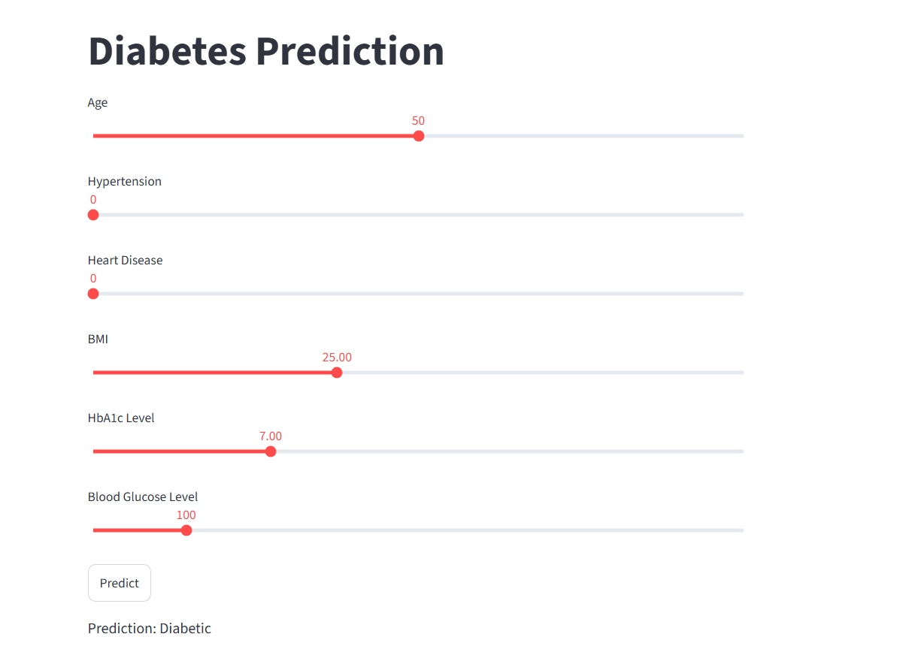

# Diabetes Prediction Using Machine Learning

## Project Overview


This project was developed as a **3rd-year mini project** to explore the use of machine learning for diabetes prediction.

The project uses selected health-related parameters as inputs and applies a trained machine learning model to predict whether a person is likely to be diabetic or not. A **Streamlit web application** was developed to provide an interactive interface for making predictions.

## 🌐 Live Demo

Try the application here:

[**🚀 Launch Diabetes Prediction App**](https://diabetes-prediction-ml-dgn35eaec7fdwedxw74jvp.streamlit.app/)

## 📸 Application Screenshot



## 🌟 Features

* Interactive Streamlit web interface
* User-friendly input sliders
* Real-time diabetes prediction
* Machine learning model integration
* Six health-related input parameters

## 🔬 Key Parameters

The application considers six health indicators:

* Age
* Hypertension
* Heart Disease
* Body Mass Index (BMI)
* HbA1c Level
* Blood Glucose Level

## 🛠️ Technologies Used

* Python
* NumPy
* Pandas
* Scikit-learn
* XGBoost
* Imbalanced-learn
* Matplotlib
* Seaborn
* Streamlit
* Jupyter Notebook
* Pickle

## 📊 How It Works

1. The user enters the required health parameters.
2. The input features are scaled using pre-computed mean and standard deviation values.
3. The trained machine learning model processes the input.
4. The application displays the prediction as **Diabetic** or **Not Diabetic**.

## 🚀 How to Run

### 1. Clone the Repository

```bash
git clone https://github.com/chandudesireddy7/diabetes-prediction-ml.git
```

### 2. Open the Project Folder

```bash
cd diabetes-prediction-ml
```

### 3. Install Dependencies

```bash
pip install -r requirements.txt
```

### 4. Run the Streamlit Application

```bash
streamlit run app.py
```

## 📁 Project Structure

```text
diabetes-prediction-ml/
│
├── app.py
├── Diabetes_Predection_Project.ipynb
├── diabetes_prediction_dataset.csv
├── final_model.pkl
├── requirements.txt
├── README.md
└── .gitignore
```

## 🎓 Project Information

**Project Type:** Mini Project
**Academic Year:** 3rd Year
**Domain:** Machine Learning / Data Science

## 🤝 Contribution

This project was developed as an academic mini project. Suggestions and improvements are welcome.

## 📝 Disclaimer

This project is developed for **educational purposes only**. The predictions generated by this application should not be considered medical advice or used as a substitute for professional medical diagnosis.

## 👨‍💻 Author

**Chandan Kumar Reddy**

GitHub: https://github.com/chandudesireddy7

LinkedIn: https://www.linkedin.com/in/desireddy-chandan-kumar-reddy-a9143634/
